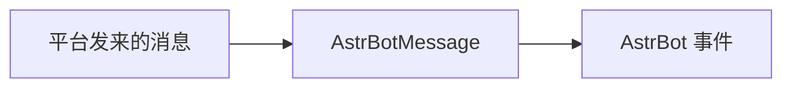

# AstrBot 插件开发资源

## 目录

- [插件开发使用的类与数据资源索引](#插件开发使用的类与数据资源索引)
- [AstrMessageEvent](#astrmessageevent)
- [AstrBotMessage](#astrbotmessage)
- [MessageType](#messagetype)
- [MessageMember](#messagemember)
- [Context](#context)
- [Star](#star)
- [StarMetadata](#starmetadata)
- [PlatformMetadata](#platformmetadata)

## 插件开发使用的类与数据资源索引

下面讲解一些插件开发中使用到的 AstrBot 核心提供的类与数据资源, 文档中不会介绍类的所有的属性, 部分属性和方法不建议在插件中使用, 这部分内容不会在这里介绍。 文档中默认 self 是指该类的实例, 你可以在对应类内部的任何方法中使用这些资源, 注意文档中的所有方法都省略了 self 参数, 你需要使用`self.属性名`或`self.方法名()`进行调用。

### AstrBot 消息事件

  * [AstrMessageEvent](#astrmessageevent)

### 功能类

  * [Star](#star)

### 数据类

  * [Context](#context)
  * [StarMetadata](#starmetadata)

## AstrMessageEvent

AstrBot 事件, AstrBot 运行的核心, AstrBot 所有操作的运行都是事件驱动的。 在插件中, 你声明的每一个`async def`函数都是一个 Handler, 它应当是一个异步协程(无 yield 返回)或异步生成器(存在一个或多个 yield)， 所有 Handler 都需要在 AstrBot 事件进入消息管道后, 被调度器触发, 在相应的阶段交由 Handler 处理。因此, 几乎所有操作都依赖于该事件, 你定义的大部分 Handler 都需要传入`event: AstrMessageEvent`参数。

```python
@filter.command("helloworld")
async def helloworld(self, event: AstrMessageEvent):
    pass
```

这是一个接受`helloworld`指令, 触发对应操作的示例, 它应当被定义在**插件类下** , 一般而言, 想要 AstrBot 进行消息之类操作, 都需要依赖`event`参数。

### 属性

#### 消息

  1. `message_str(str)`: 纯文本消息, 例如收到消息事件"你好", `event.message_str`将会是`"你好"`
  2. `message_obj(AstrBotMessage)`: 消息对象, 参考: [AstrBotMessage](#astrbotmessage)
  3. `is_at_or_wake_command(bool)`: 是否@了机器人/消息带有唤醒词/为私聊(插件注册的事件监听器会让 is_wake 设为 True, 但是不会让这个属性置为 True)

#### 消息来源

  4. `role(str)`: 用户是否为管理员, 两个可选选项:`"member" or "admin"`
  5. `platform_meta(PlatformMetadata)`: 消息平台的信息, 参考: [PlatformMetadata](#platformmetadata)
  6. `session_id(str)`: 不包含平台的会话 id, 以 qq 平台为例, 在私聊中它是对方 qq 号, 在群聊中它是群号, 它无法标记具体平台, 建议直接使用 9 中的`unified_msg_origin`作为代替
  7. `session(MessageSession)`: 会话对象, 用于唯一识别一个会话, `unified_msg_origin`是它的字符串表示, `session_id`等价于`session.session_id`
  8. `unified_msg_origin(str)`: 会话 id, 格式为: `platform_name:message_type:session_id`, 建议使用

#### 事件控制

  9. `is_wake(bool)`: 机器人是否唤醒(通过 WakingStage, 详见: [WakingStage(施工中)]), 如果机器人未唤醒, 将不会触发后面的阶段
  10. `call_llm(bool)`: 是否在此消息事件中禁止默认的 LLM 请求, 对于每个消息事件, AstrBot 会默认调用一次 LLM 进行回复

### 方法

#### 消息相关

  1. get_message_str

```python
get_message_str() -> str
# 等同于self.message_str
```

该方法用于获取该事件的文本消息字符串。

  2. get_message_outline

```python
get_message_outline() -> str
```

该方法用于获取消息概要, 不同于 2, 它不会忽略其他消息类型(如图片), 而是会将其他消息类型转换为对应的占位符, 例如图片会被转换为`"[图片]"`

  3. get_messages

```python
get_messages() -> List[BaseMessageComponent]
```

该方法返回一个消息列表，包含该事件中的所有消息组件。该列表中的每个组件都可以是文本、图片或其他类型的消息。组件参考: [BaseMessageComponent(施工中)]

  4. get_message_type

```python
get_message_type() -> MessageType
```

该方法用于获取消息类型, 消息类型参考: [MessageType](#messagetype)

  5. is_private_chat

```python
is_private_chat() -> bool
```

该方法用于判断该事件是否由私聊触发

  6. is_admin

```python
is_admin()
# 等同于self.role == "admin"
```

该方法用于判断该事件是否为管理员发出

#### 消息平台相关

  7. get_platform_name

```python
get_platform_name() -> str
# 等同于self.platform_meta.name
```

该方法用于获取该事件的平台名称, 例如`"aiocqhttp"`。 如果你的插件想只对某个平台的消息事件进行处理, 可以通过该方法获取平台名称进行判断。

#### ID 相关

  8. get_self_id

```python
get_self_id() -> str
```

该方法用于获取 Bot 自身 id(自身 qq 号)

  9. get_sender_id

```python
get_sender_id() -> str
```

该方法用于获取该消息发送者 id(发送者 qq 号)

  10. get_sender_name

```python
get_sender_name() -> str
```

该方法用于获取消息发送者的昵称(可能为空)

  11. get_group_id

```python
get_group_id() -> str
```

该方法用于获取群组 id(qq 群群号), 如果不是群组消息将放回 None

#### 会话控制相关

  12. get_session_id

```python
get_session_id() -> str
# 等同于self.session_id或self.session.session_id
```

该方法用于获取当前会话 id, 格式为 `platform_name:message_type:session_id`

  13. get_group

```python
get_group(group_id: str = None, **kwargs) -> Optional[Group]
```

该方法用于获取一个群聊的数据, 如果不填写`group_id`, 默认返回当前群聊消息, 在私聊中如果不填写该参数将返回 None

仅适配 gewechat 与 aiocqhttp

#### 事件状态

  14. is_wake_up

```python
is_wake_up() -> bool
# 等同于self.is_wake
```

该方法用于判断该事件是否唤醒 Bot

  15. stop_event

```python
stop_event()
```

该方法用于终止事件传播, 调用该方法后, 该事件将停止后续处理

  16. continue_event

```python
continue_event()
```

该方法用于继续事件传播, 调用该方法后, 该事件将继续后续处理

  17. is_stopped

```python
is_stopped() -> bool
```

该方法用于判断该事件是否已经停止传播

#### 事件结果

  18. set_result

```python
set_result(result: Union[MessageEventResult, str])
```

该方法用于设置该消息事件的结果, 该结果是 Bot 发送的内容 它接受一个参数:

  * result: MessageEventResult(参考:[MessageEventResult(施工中)]) 或字符串, 若为字符串, Bot 会发送该字符串消息

  19. get_result

```python
get_result() -> MessageEventResult
```

该方法用于获取消息事件的结果, 该结果类型参考: [MessageEventResult(施工中)]

  20. clear_result

```python
clear_result()
```

该方法用于清除消息事件的结果

#### LLM 相关

  21. should_call_llm

```python
should_call_llm(call_llm: bool)
```

该方法用于设置是否在此消息事件中禁止默认的 LLM 请求 只会阻止 AstrBot 默认的 LLM 请求(即收到消息->请求 LLM 进行回复)，不会阻止插件中的 LLM 请求

  22. request_llm

```python
request_llm(prompt: str,
        func_tool_manager=None,
        session_id: str = None,
        image_urls: List[str] = [],
        contexts: List = [],
        system_prompt: str = "",
        conversation: Conversation = None,
        ) -> ProviderRequest
```

该方法用于创建一个 LLM 请求

接受 7 个参数:

  * prompt(str): 提示词
  * func_tool_manager(FuncCall): 函数工具管理器, 参考: [FuncCall(施工中)]
  * session_id(str): 已经过时, 留空即可
  * image_urls(List(str)): 发送给 LLM 的图片, 可以为 base64 格式/网络链接/本地图片路径
  * contexts(List): 当指定 contexts 时, 将使用其中的内容作为该次请求的上下文(而不是聊天记录)
  * system_prompt(str): 系统提示词
  * conversation(Conversation): 可选, 在指定的对话中进行 LLM 请求, 将使用该对话的所有设置(包括人格), 结果也会被保存到对应的对话中

#### 发送消息相关

一般作为生成器返回, 让调度器执行相应操作:

```python
yield event.func()
```

  23. make_result

```python
make_result() -> MessageEventResult
```

该方法用于创建一个空的消息事件结果

  24. plain_result

```python
plain_result(text: str) -> MessageEventResult
```

该方法用于创建一个空的消息事件结果, 包含文本消息:text

  25. image_result

```python
image_result(url_or_path: str) -> MessageEventResult
```

该方法用于创建一个空的消息事件结果, 包含一个图片消息, 其中参数`url_or_path`可以为图片网址或本地图片路径

  26. chain_result

```python
chain_result(chain: List[BaseMessageComponent]) -> MessageEventResult
```

该方法用于创建一个空的消息事件结果, 包含整个消息链, 消息链是一个列表, 按顺序包含各个消息组件, 消息组件参考: [BaseMessageComponent(施工中)]

  27. send

```python
send(message: MessageChain)
```

注意这个方法不需要使用 yield 方式作为生成器返回来调用, 请直接使用`await event.send(message)` 该方法用于发送消息到该事件的当前对话中

接受 1 个参数:

  * message(MessageChain): 消息链, 参考: [MessageChain(施工中)]

#### 其他

  28. set_extra

```python
set_extra(key, value)
```

该方法用于设置事件的额外信息, 如果你的插件需要分几个阶段处理事件, 你可以在这里将额外需要传递的信息存储入事件 接受两个参数:

  * key(str): 键名
  * value(any): 值

需要和 12 一起使用

  29. get_extra

```python
get_extra(key=None) -> any
```

该方法用于获取 11 中设置的额外信息, 如果没有提供键名将返回所有额外信息, 它是一个字典。

  30. clear_extra

```python
clear_extra()
```

该方法用于清除该事件的所有额外信息

## AstrBotMessage

AstrBot 消息对象, 它是一个消息的容器, 所有平台的消息在接收时都被转换为该类型的对象, 以实现不同平台的统一处理。

对于每个事件, 一定都有一个驱动该事件的 AstrBotMessage 对象。



### 属性

  1. `type(MessageType)`: 消息类型, 参考: [MessageType](#messagetype)
  2. `self_id(str)`: 机器人自身 id, 例如在 aiocqhttp 平台, 它是机器人自身的 qq 号
  3. `session_id(str)`: 不包含平台的会话 id, 以 qq 平台为例, 在私聊中它是对方 qq 号, 在群聊中它是群号
  4. `message_id(str)`: 消息 id, 消息的唯一标识符, 用于引用或获取某一条消息
  5. `group_id(str)`: 群组 id, 如果为私聊, 则为空字符串
  6. `sender(MessageMember)`: 消息发送者, 参考: [MessageMember](#messagemember)
  7. `message(List[BaseMessageComponent])`: 消息链(Nakuru 格式), 包含该事件中的所有消息内容, 参考: [BaseMessageComponent(施工中)]
  8. `message_str(str)`: 纯文本消息字符串, 相当于把消息链转换为纯文本(会丢失信息!)
  9. `raw_message(object)`: 原始消息对象, 包含所有消息的原始数据(平台适配器发来的)
  10. `timestamp(int)`: 消息的时间戳(会自动初始化)

## MessageType

消息类型, 用于区分消息是私聊还是群聊消息, 继承自`Enum`枚举类型

使用方法如下:

```python
from astrbot.api import MessageType
print(MessageType.GROUP_MESSAGE)
```

### 内容

  1. `GROUP_MESSAGE`: 群聊消息
  2. `FRIEND_MESSAGE`: 私聊消息
  3. `OTHER_MESSAGE`: 其他消息, 例如系统消息等

## MessageMember

消息发送者对象, 用于标记一个消息发送者的最基本信息

### 属性

  1. `user_id(str)`: 消息发送者 id, 唯一, 例如在 aiocqhttp 平台, 它是发送者的 qq 号
  2. `nickname(str)`: 昵称, 例如在 aiocqhttp 平台, 它是发送者的 qq 昵称, 它会被自动初始化

## Context

暴露给插件的上下文, 该类的作用就是为插件提供接口和数据。

### 属性:

  1. `provider_manager`: 供应商管理器对象
  2. `platform_manager`: 平台管理器对象

### 方法:

#### 插件相关

  1. get_registered_star

```python
get_registered_star(star_name: str) -> StarMetadata
```

该方法根据输入的插件名获取插件的元数据对象, 该对象包含了插件的基本信息, 例如插件的名称、版本、作者等。 该方法可以获取其他插件的元数据。 StarMetadata 详情见[StarMetadata](#starmetadata)

  2. get_all_stars

```python
get_all_stars() -> List[StarMetadata]
```

该方法获取所有已注册的插件的元数据对象列表, 该列表包含了所有插件的基本信息。 StarMetadata 详情见[StarMetadata](#starmetadata)

#### 函数工具相关

  3. get_llm_tool_manager

```python
get_llm_tool_manager() -> FuncCall
```

该方法获取 FuncCall 对象, 该对象用于管理注册的所有函数调用工具。

  4. activate_llm_tool

```python
activate_llm_tool(name: str) -> bool
```

该方法用于激活指定名称的**已经注册** 的函数调用工具, 已注册的函数调用工具**默认为激活状态** , 不需要手动激活。 如果没能找到指定的函数调用工具, 则返回`False`。

  5. deactivate_llm_tool

```python
deactivate_llm_tool(name: str) -> bool
```

该方法用于停用指定名称的**已经注册** 的函数调用工具。 如果没能找到指定的函数调用工具, 则返回`False`。

#### 供应商相关

  6. register_provider

```python
register_provider(provider: Provider)
```

该方法用于注册一个新**用于文本生成的** 的供应商对象, 该对象必须是 Provider 类。 **用于文本生成的** 的 Provider 类型为 Chat_Completion, 后面将不再重复。

  7. get_provider_by_id

```python
get_provider_by_id(provider_id: str) -> Provider
```

该方法根据输入的供应商 ID 获取供应商对象。

  8. get_all_providers

```python
get_all_providers() -> List[Provider]
```

该方法获取所有已注册的**用于文本生成的** 供应商对象列表。

  9. get_all_tts_providers

```python
get_all_tts_providers() -> List[TTSProvider]
```

该方法获取所有已注册的**文本到语音** 供应商对象列表。

  10. get_all_stt_providers

```python
get_all_stt_providers() -> List[STTProvider]
```

该方法获取所有已注册的**语音到文本** 供应商对象列表。

  11. get_using_provider

```python
get_using_provider() -> Provider
```

该方法获取当前使用的**用于文本生成的** 供应商对象。

  12. get_using_tts_provider

```python
get_using_tts_provider() -> TTSProvider
```

该方法获取当前使用的**文本到语音** 供应商对象。

  13. get_using_stt_provider

```python
get_using_stt_provider() -> STTProvider
```

该方法获取当前使用的**语音到文本** 供应商对象。

#### 其他

  14. get_config

```python
get_config() -> AstrBotConfig
```

该方法获取当前 AstrBot 的配置对象, 该对象包含了插件的所有配置项与 AstrBot Core 的所有配置项(谨慎修改!)。

  15. get_db

```python
get_db() -> BaseDatabase
```

该方法获取 AstrBot 的数据库对象, 该对象用于访问数据库, 该对象是 BaseDatabase 类的实例。

  16. get_event_queue

```python
get_event_queue() -> Queue
```

该方法用于获取 AstrBot 的事件队列, 这是一个异步队列, 其中的每一项都是一个 AstrMessageEvent 对象。

  17. get_platform

```python
get_platform(platform_type: Union[PlatformAdapterType, str]) -> Platform
```

该方法用于获取指定类型的平台适配器对象。

  18. send_message

```python
send_message(session: Union[str, MessageSesion], message_chain: MessageChain) -> bool
```

该方法可以根据会话的唯一标识符-session(unified_msg_origin)主动发送消息。

它接受两个参数：

  * session: 会话的唯一标识符, 可以是字符串或 MessageSesion 对象， 获取该标识符参考：[获取会话的 session]。
  * message_chain: 消息链对象, 该对象包含了要发送的消息内容, 该对象是 MessageChain 类的实例。

该方法返回一个布尔值, 表示是否找到对应的消息平台。

  * **注意: 该方法不支持 qq_official 平台!!**

## Star

插件类的基类, 所有插件都必须继承自该类, 并且实现一些必要的方法。

### 方法:

#### 基础方法 ​

  1. default_config

```python
default_config() -> dict
```

该方法返回插件的默认配置, 返回值为一个字典, 该字典中的内容作为插件的默认配置项, 用户可以通过 WebUI 对这些配置项进行修改。

  2. load

```python
load(astrbot_context: Context)
```

该方法用于加载插件, 插件的初始化工作应当在该方法中完成。 该方法被调用时, 插件被正式加载。 该方法接收一个 Context 对象, 该对象包含了插件所需的上下文信息。 Context 参考: [Context](#context)

  3. unload

```python
unload()
```

该方法用于卸载插件, 插件的清理工作应当在该方法中完成。 该方法被调用时, 插件被正式卸载。

  4. metadata

```python
metadata() -> StarMetadata
```

该方法返回插件的元数据, 返回值为一个字典, 该字典中的内容作为插件的元数据, 即插件的基本信息, 用于展示在 WebUI 中。

元数据参考: [StarMetadata](#starmetadata)

#### Handler ​

  5. 自定义 Handler

```python
@filter.decorator
async def handler_name(self, event: AstrMessageEvent):
    # 处理消息事件
```

插件可以定义多个 Handler 函数, 这些函数会在消息事件触发时被调用。 Handler 是一个异步函数, 它接收一个 AstrMessageEvent 对象, 该对象包含了消息事件的所有信息。 AstrMessageEvent 参考: [AstrMessageEvent](#astrmessageevent)

自定义 Handler 的函数名可以为任何非下划线开头的名称, 函数体内可以进行任何操作。

## StarMetadata

插件的元数据。

### 属性:

#### 基础属性

  1. `name(str)`: 插件名称
  2. `author(str)`: 插件作者
  3. `desc(str)`: 插件简介
  4. `version(str)`: 插件版本
  5. `repo(str)`: 插件仓库地址

#### 插件类, 模块属性

  6. `star_cls_type(type)`: 插件类对象类型, 例如你的插件类名为`HelloWorld`, 该属性就是`<type 'HelloWorld'>`
  7. `star_cls(object)`: 插件的类对象, 它是一个实例, 你可以使用它调用插件的方法和属性
  8. `module_path(str)`: 插件模块的路径
  9. `module(ModuleType)`: 插件的模块对象
  10. `root_dir_name(str)`: 插件的目录名称

#### 插件身份&状态属性

  11. `reserved(bool)`: 是否为 AstrBot 保留插件
  12. `activated(bool)`: 是否被激活

#### 插件配置

  13. `config(AstrBotConfig)`: 插件配置对象

#### 注册的 Handler 全名列表

  14. `star_handler_full_names(List(str))`: 注册的 Handler 全名列表, Handler 相关请见核心代码解释->插件注册(施工中)

#### 其它

该类实现了`__str__`方法, 因此你可以打印插件信息。

## PlatformMetadata

平台元数据, 包含了平台的基本信息, 例如平台名称, 平台类型等.

### 属性

  1. `name(str)`: 平台的名称
  2. `description(str)`: 平台的描述
  3. `id(str)`: 平台的唯一标识符, 用于区分不同的平台
  4. `default_config_tmpl(dict)`: 平台的默认配置模板, 用于生成平台的默认配置文件
  5. `adapter_display_name(str)`: 显示在 WebUI 中的平台名称, 默认为 `name`(可以更改) 
---
## 注意：获取 QQ 官方平台凭据
为了兼容 AstrBot 各版本和多种平台配置，插件的 `_get_app_credentials` 实现逻辑如下：

1. 优先通过 `context.get_platform(PlatformAdapterType.QQOFFICIAL)` 获取官方适配器实例。
2. 再尝试 `context.get_platform("qq_official")` 与 `context.get_platform("qqbot")`。
3. 若仍未获取，则遍历 `context.platform_manager.get_insts()`，匹配 `platform.config.id == "qq_official"` 或 `platform.config.type` 前缀。
4. 最后从 `platform.config` 字典读取以下字段，并兼容多种命名：
   - `appid` / `appId` / `app_id`
   - `secret` / `clientSecret` / `client_secret`

示例代码见 `plugins/astrbot_plugin_wanbot1/main.py` 中 `_get_app_credentials` 方法。 